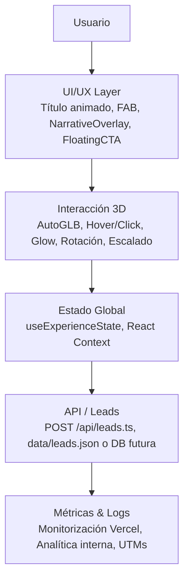
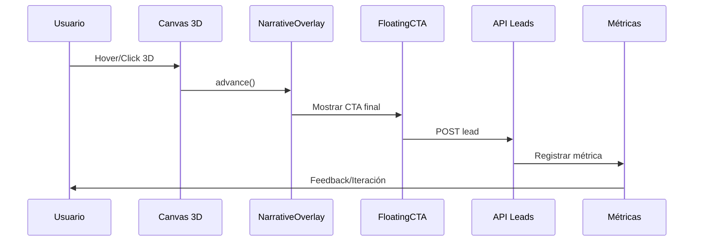

# RUMOR.RED – Protocolo de Transmisión y Flujo de Despliegue

## 1️⃣ Arquitectura General y Flujo de la Simulación

---

## 2️⃣ Protocolo Operativo de Deploy

```mermaid
flowchart LR
    subgraph Predeploy
        A1[Limpieza código]
        A2[Optimización assets]
        A3[Build y validación]
    end
    subgraph Deploy
        B1[Deploy Vercel]
        B2[Variables entorno]
        B3[Smoke test]
    end
    subgraph Postdeploy
        C1[Logs y leads]
        C2[Métricas usuario]
        C3[Iteración rápida]
    end
    subgraph Evolución
        D1[Leads a DB]
        D2[AB Testing]
        D3[AR/VR]
        D4[CI/CD]
    end
    Predeploy --> Deploy --> Postdeploy --> Evolución
```

---

## 3️⃣ Flujo Visual Operativo

---

## 4️⃣ Checklist de Deploy Diario

- [ ] Limpieza de código + assets optimizados
- [ ] Build local exitoso
- [ ] Variables de entorno configuradas
- [ ] Deploy Vercel
- [ ] Smoke Test: 3D, hover, click, CTA
- [ ] Logs revisados, leads validados
- [ ] Iteración rápida aplicada si falla algo

---

**Este documento sirve como guía visual y técnica para el equipo RUMORR: desde el flujo de usuario hasta el deploy y la evolución futura.**
